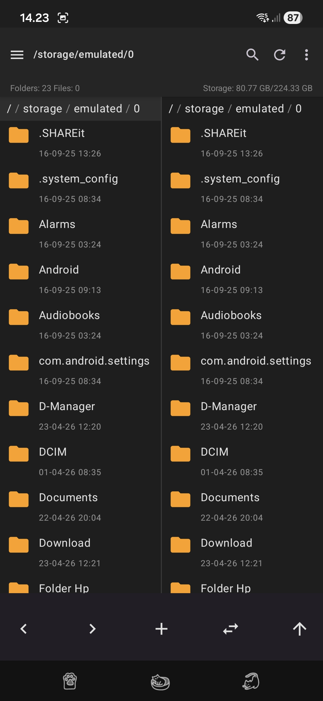
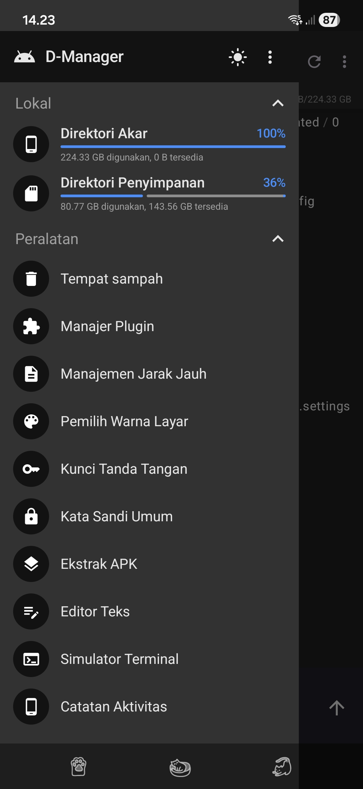

# D-Manager (Dewa File Manager)

<div align="center">

File manager Android berbasis **Kotlin + Jetpack Compose** dengan gaya dual-pane ala MT Manager.


</div>

## ✨ Fitur Utama

- **Dual Pane Explorer**
  - Panel kiri dan kanan aktif secara independen.
  - Navigasi cepat antar folder untuk copy/move workflow.

- **MT-Style Drawer**
  - Sidebar custom dengan section Lokal & Peralatan.
  - Aksi cepat ke penyimpanan utama dan tempat sampah.

- **Recycle Bin (`D-Manager/recycle`)**
  - Hapus file/folder tidak langsung permanen.
  - Item dipindahkan ke `D-Manager/recycle`.

- **Archive Explorer Inline (ZIP/RAR)**
  - Buka `.zip` dan `.rar` langsung di panel aktif.
  - Masuk folder di dalam arsip.
  - Mendukung **nested archive** (zip di dalam zip/rar).
  - Dukungan arsip terkunci (password prompt).

- **ZIP Creation + Password (AES)**
  - Kompres file/folder ke ZIP.
  - Opsi enkripsi ZIP dengan kata sandi.

- **Text & Code Editor**
  - Edit file teks/kode langsung di app.
  - Syntax highlighting + zoom editor.
  - Dotfiles seperti `.env`, `.gitignore`, `.htaccess` didukung.
  - Edit file teks di dalam ZIP dan simpan balik ke arsip.

- **APK Tools**
  - Detail APK (package, version, signature, SDK info).
  - Install APK dari file manager.

- **Media Viewer**
  - Image viewer (zoom/pan).
  - Video player bawaan.

- **Tema**
  - Dark mode & light mode.

---

## 🖼️ Screenshot

<div align="center">
  
  
</div>

---

## 🧱 Tech Stack

- **Language:** Kotlin
- **UI:** Jetpack Compose + Material 3
- **Architecture:** ViewModel + Repository
- **Archive Library:**
  - `zip4j` (ZIP + encryption)
  - `junrar` (RAR browsing/extraction)

---

## 📱 SDK & Build Configuration

Diambil dari konfigurasi project saat ini:

- `compileSdk = 36`
- `minSdk = 29`
- `targetSdk = 36`
- Kotlin `2.0.21`
- Android Gradle Plugin `8.13.2`
- Java target `11`

---

## 🚀 Cara Menjalankan (Setup Lokal)

### Prasyarat

- Android Studio (versi terbaru disarankan)
- Android SDK 36 terpasang
- Perangkat Android (USB debugging aktif) atau emulator

### Langkah

1. Clone repository:
   ```bash
   git clone https://github.com/akbarxleqi/dewafilemanager.git
   cd dewafilemanager
   ```

2. Buka project di Android Studio.

3. Tunggu Gradle sync selesai.

4. Jalankan build debug:
   ```bash
   ./gradlew :app:assembleDebug
   ```

5. Install ke device:
   ```bash
   adb install -r app/build/outputs/apk/debug/app-debug.apk
   adb shell am start -n com.dewa.filemanager/.MainActivity
   ```

6. Saat pertama kali membuka app, berikan izin storage (`All files access`).

---

## 🗂️ Struktur Penting Project

- `app/src/main/java/com/dewa/filemanager/ui/explorer/` → layar utama dual pane
- `app/src/main/java/com/dewa/filemanager/ui/editor/` → text/code editor
- `app/src/main/java/com/dewa/filemanager/ui/viewer/` → image/video/archive viewer
- `app/src/main/java/com/dewa/filemanager/data/repository/` → operasi file & arsip
- `docs/screenshots/` → screenshot README

---

## 👨‍💻 Developer

**Devi Akbar**  
Mahasiswa Universitas Siber Muhammadiyah  
📧 **akbarxtech@gmail.com**

---

## 📌 Catatan

Project ini masih aktif dikembangkan. Beberapa menu tools di drawer saat ini masih bertanda *Coming Soon*.
